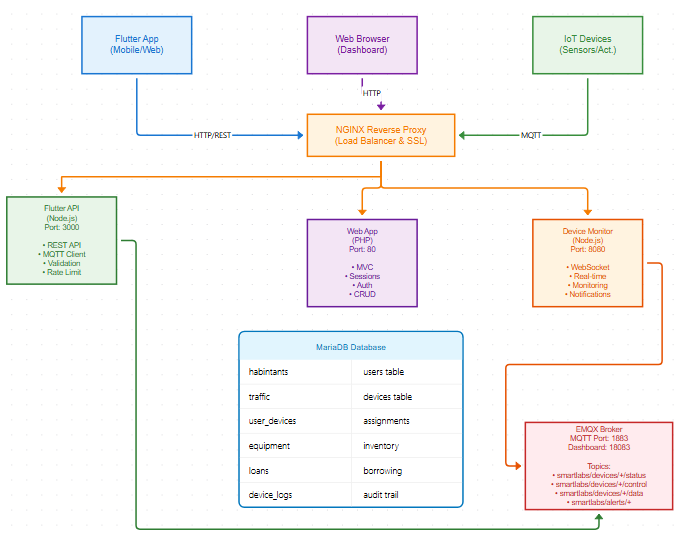
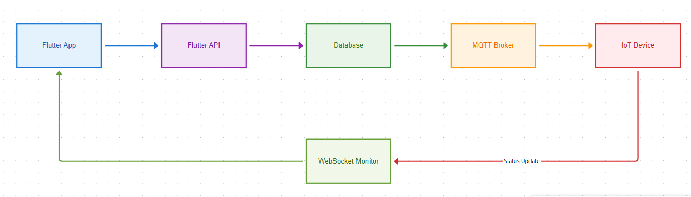
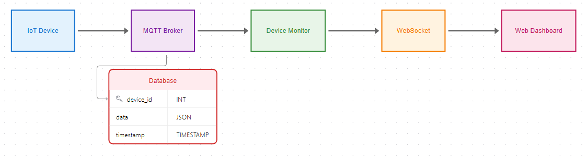
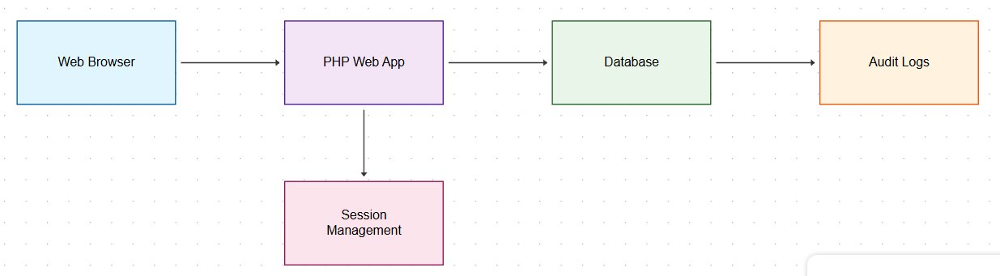

# SmartLabs - Sistema de Gestión de Laboratorios IoT

## 🚀 Descripción

SmartLabs es un **sistema integral de gestión de laboratorios inteligentes** que revoluciona la forma en que se administran y controlan los espacios de investigación y desarrollo. Combina tecnologías IoT, aplicaciones móviles, interfaces web y comunicación en tiempo real para crear un ecosistema completo de gestión de laboratorios.

### 🎯 ¿Qué Problemas Soluciona SmartLabs?

#### 🔧 **Control de Dispositivos IoT**

- **Problema**: Gestión manual y descentralizada de equipos de laboratorio
- **Solución**: Control remoto unificado desde aplicaciones móviles y web
- **Beneficio**: Monitoreo 24/7, automatización de procesos, reducción de errores humanos

#### 📊 **Monitoreo en Tiempo Real**

- **Problema**: Falta de visibilidad del estado actual de dispositivos y equipos
- **Solución**: Dashboard en tiempo real con WebSocket para actualizaciones instantáneas
- **Beneficio**: Detección temprana de fallos, optimización de recursos, toma de decisiones informada

#### 👥 **Gestión de Usuarios y Accesos**

- **Problema**: Control manual de accesos y permisos en laboratorios
- **Solución**: Sistema de autenticación con roles y permisos granulares
- **Beneficio**: Seguridad mejorada, trazabilidad de acciones, cumplimiento normativo

#### 📦 **Administración de Préstamos**

- **Problema**: Gestión manual de préstamos de equipos con pérdida de inventario
- **Solución**: Sistema automatizado de préstamos con seguimiento completo
- **Beneficio**: Reducción de pérdidas, optimización de inventario, historial completo

#### 🔗 **Integración de Sistemas**

- **Problema**: Sistemas aislados sin comunicación entre sí
- **Solución**: Arquitectura de microservicios con APIs REST y comunicación MQTT
- **Beneficio**: Escalabilidad, mantenibilidad, integración con sistemas externos

## 🏗️ Arquitectura del Sistema

### 📐 Diagrama de Arquitectura General



### 🔄 Flujo de Datos e Interacciones

#### 1. **Control de Dispositivos desde Flutter App**



#### 2. **Monitoreo en Tiempo Real**



#### 3. **Gestión Web de Usuarios y Préstamos**

```

```

### 🧩 Componentes Detallados

#### **Flutter API (Node.js) - Puerto 3000**

```javascript
// Arquitectura de la API
api/
├── controllers/     # Lógica de endpoints
│   ├── DeviceController.js
│   ├── UserController.js
│   └── LoanController.js
├── services/        # Lógica de negocio
│   ├── DeviceService.js
│   ├── MQTTService.js
│   └── DatabaseService.js
├── middleware/      # Validación y seguridad
│   ├── auth.js
│   ├── validation.js
│   └── rateLimit.js
├── routes/          # Definición de rutas
└── config/          # Configuración
```

**Responsabilidades:**

- 🔌 **API REST** para aplicaciones Flutter
- 🔐 **Autenticación** y autorización
- 📡 **Cliente MQTT** para comunicación IoT
- ✅ **Validación** de datos de entrada
- 🛡️ **Rate limiting** y seguridad
- 📊 **Logging** y monitoreo

#### **Device Monitor (Node.js) - Puerto 8080**

```javascript
// Arquitectura del Monitor
monitor/
├── services/
│   ├── DeviceMonitor.js    # Monitoreo principal
│   ├── WebSocketServer.js  # Servidor WebSocket
│   └── DatabaseWatcher.js  # Observador de BD
├── managers/
│   ├── ConnectionManager.js
│   └── SubscriptionManager.js
└── config/
```

**Responsabilidades:**

- 🔄 **WebSocket Server** para tiempo real
- 👀 **Monitoreo continuo** de dispositivos
- 📢 **Notificaciones** instantáneas
- 🔗 **Gestión de conexiones** de clientes
- 📈 **Métricas** de rendimiento

#### **Web Application (PHP MVC) - Puerto 80**

```php
// Arquitectura MVC
app/
├── controllers/     # Controladores
│   ├── AuthController.php
│   ├── DashboardController.php
│   ├── DeviceController.php
│   └── LoanController.php
├── models/          # Modelos de datos
│   ├── User.php
│   ├── Device.php
│   └── Loan.php
├── views/           # Vistas HTML
│   ├── layout/
│   ├── dashboard/
│   └── device/
└── core/            # Núcleo del framework
    ├── Router.php
    ├── Controller.php
    └── Database.php
```

**Responsabilidades:**

- 🖥️ **Dashboard administrativo** web
- 👤 **Gestión de usuarios** y roles
- 📦 **Sistema de préstamos** completo
- 📊 **Reportes** y estadísticas
- 🔐 **Autenticación** web con sesiones
- 🎨 **Interfaz responsive** con Bootstrap

### 🔄 Patrones de Comunicación

#### **Comunicación Síncrona (HTTP/REST)**

- Flutter App ↔ Flutter API
- Web Browser ↔ PHP Web App
- Health checks entre servicios

#### **Comunicación Asíncrona (MQTT)**

- Flutter API ↔ IoT Devices
- Device Monitor ↔ IoT Devices
- Notificaciones y alertas

#### **Comunicación en Tiempo Real (WebSocket)**

- Device Monitor ↔ Web Dashboard
- Device Monitor ↔ Flutter App
- Actualizaciones instantáneas de estado

### 🛡️ Seguridad y Escalabilidad

#### **Medidas de Seguridad**

- 🔐 **Autenticación JWT** en API
- 🛡️ **Rate limiting** por IP
- 🔒 **HTTPS/SSL** en producción
- 🚫 **Validación** de entrada
- 📝 **Audit logs** completos

#### **Escalabilidad**

- 🐳 **Containerización** con Docker
- ⚖️ **Load balancing** con Nginx
- 📊 **Monitoreo** de métricas
- 🔄 **Auto-scaling** horizontal
- 💾 **Caching** de datos frecuentes

## 📁 Estructura del Proyecto

```
smartlabs/
├── flutter-api/          # API REST para Flutter (Node.js)
│   ├── src/
│   │   ├── controllers/  # Lógica de endpoints
│   │   ├── services/     # Servicios de negocio
│   │   ├── middleware/   # Autenticación y validación
│   │   ├── routes/       # Definición de rutas
│   │   └── config/       # Configuración de BD y MQTT
│   ├── docs/             # Documentación técnica
│   └── package.json      # Dependencias Node.js
├── node/                 # Servicio de monitoreo WebSocket
│   ├── src/
│   │   ├── services/     # Monitor y WebSocket server
│   │   ├── managers/     # Gestión de conexiones
│   │   └── config/       # Configuración del monitor
│   ├── docs/             # Documentación técnica
│   └── package.json      # Dependencias Node.js
├── app/                  # Aplicación web PHP (MVC)
│   ├── controllers/      # Controladores web
│   ├── models/           # Modelos de datos
│   ├── views/            # Templates HTML
│   ├── core/             # Framework base (Router, DB)
│   ├── docs/             # Documentación técnica
│   └── helpers/          # Funciones auxiliares
├── config/               # Configuración PHP global
├── public/               # Punto de entrada web
├── docker/               # Configuraciones Docker
│   ├── api/              # Dockerfile para Flutter API
│   ├── monitor/          # Dockerfile para Monitor
│   ├── web/              # Dockerfile para Web App
│   └── nginx/            # Configuración Nginx
├── docker-compose.yml    # Orquestación completa
├── docker-dev.yml        # Desarrollo local
├── .env.example          # Template de variables
├── DOCUMENTACION_SMARTLABS.md  # Documentación completa
└── index.php             # Front controller
```

## 🎯 Casos de Uso Específicos

### 📱 **Escenario 1: Control Remoto desde App Móvil**

```
👤 Usuario → 📱 Flutter App → 🔌 API REST → 💾 Database → 📡 MQTT → 🔧 Dispositivo IoT
                                                              ↓
📊 Dashboard Web ← 🔄 WebSocket ← 👀 Monitor Service ← 📡 MQTT ← 📈 Status Update
```

**Flujo Detallado:**

1. Usuario abre app Flutter y ve lista de dispositivos asignados
2. Selecciona dispositivo y presiona "Encender"
3. App envía POST a `/api/devices/control` con credenciales
4. API valida usuario, verifica permisos y registra acción
5. API publica mensaje MQTT a `smartlabs/devices/{serie}/control`
6. Dispositivo IoT recibe comando y cambia estado
7. Dispositivo publica estado a `smartlabs/devices/{serie}/status`
8. Monitor Service detecta cambio y actualiza base de datos
9. Monitor envía notificación WebSocket a dashboard web
10. Dashboard actualiza estado en tiempo real

### 🖥️ **Escenario 2: Gestión de Préstamos Web**

```
👨‍💼 Admin → 🌐 Web Browser → 🖥️ PHP App → 💾 Database → 📧 Notifications
                                              ↓
📱 Flutter App ← 🔔 Push Notification ← 📡 API ← 📊 Loan Status
```

**Flujo Detallado:**

1. Administrador accede al panel web de préstamos
2. Busca usuario por matrícula o nombre
3. Selecciona equipo disponible del inventario
4. Registra préstamo con fecha límite
5. Sistema genera código QR para el préstamo
6. Usuario recibe notificación en app móvil
7. Al devolver, admin escanea QR y marca como devuelto
8. Sistema actualiza inventario y genera reporte

### 📊 **Escenario 3: Monitoreo en Tiempo Real**

```
🔧 Sensores IoT → 📡 MQTT → 👀 Monitor → 🔄 WebSocket → 📊 Dashboard
                           ↓
                    💾 Database → 📈 Analytics → 🚨 Alerts
```

**Flujo Detallado:**

1. Sensores envían datos cada 30 segundos vía MQTT
2. Monitor Service procesa y almacena en base de datos
3. Dashboard web muestra gráficos en tiempo real
4. Sistema detecta anomalías (temperatura alta, fallo de conexión)
5. Genera alertas automáticas vía email/push notifications
6. Administradores pueden tomar acción inmediata

## 📈 Beneficios Cuantificables

### 🎯 **Eficiencia Operacional**

- ⏱️ **Reducción del 70%** en tiempo de gestión manual
- 🔍 **99.9% de visibilidad** del estado de dispositivos
- 📉 **Reducción del 50%** en pérdida de equipos
- ⚡ **Respuesta en <2 segundos** para control de dispositivos

### 💰 **Ahorro de Costos**

- 💵 **Reducción del 40%** en costos operativos
- 🔧 **Mantenimiento predictivo** reduce fallos en 60%
- 📦 **Optimización de inventario** ahorra 30% en compras
- 👥 **Automatización** reduce necesidad de personal en 25%

### 🛡️ **Seguridad y Cumplimiento**

- 📝 **100% de trazabilidad** de acciones
- 🔐 **Acceso controlado** con autenticación robusta
- 📊 **Reportes automáticos** para auditorías
- 🚨 **Alertas inmediatas** ante incidentes

## 🔧 Tecnologías y Herramientas

### **Backend Technologies**

- **Node.js 18+**: Runtime para APIs y servicios
- **Express.js**: Framework web para APIs REST
- **Socket.io**: WebSocket para tiempo real
- **MQTT.js**: Cliente MQTT para IoT
- **MySQL2**: Driver de base de datos
- **JWT**: Autenticación stateless
- **Bcrypt**: Hash seguro de contraseñas
- **Joi**: Validación de esquemas
- **Winston**: Logging estructurado

### **Frontend Technologies**

- **PHP 8.2+**: Lenguaje del servidor web
- **Bootstrap 5**: Framework CSS responsive
- **jQuery 3.6**: Manipulación DOM
- **Chart.js**: Gráficos interactivos
- **Font Awesome**: Iconografía
- **DataTables**: Tablas avanzadas

### **Infrastructure & DevOps**

- **Docker & Docker Compose**: Containerización
- **Nginx**: Reverse proxy y load balancer
- **MariaDB 10.6**: Base de datos relacional
- **EMQX**: Broker MQTT empresarial
- **Redis**: Cache y sesiones (opcional)
- **Let's Encrypt**: Certificados SSL gratuitos

### **Development & Testing**

- **Jest**: Testing para Node.js
- **PHPUnit**: Testing para PHP
- **Postman**: Testing de APIs
- **Git**: Control de versiones
- **GitHub Actions**: CI/CD
- **ESLint**: Linting para JavaScript
- **PHP_CodeSniffer**: Estándares PHP

## 🚀 Inicio Rápido

### Desarrollo Local (Laragon)

1. **Servicios esenciales con Docker**:

```bash
docker-compose -f docker-dev.yml up -d
```

2. **API Flutter**:

```bash
cd flutter-api
npm install
npm run dev  # Puerto 3000
```

3. **Monitor de dispositivos**:

```bash
cd node
npm install
npm run dev  # Puerto 8080
```

4. **Aplicación web**: Configurar en Laragon apuntando a `c:\laragon\www`

### Despliegue Completo

```bash
# Configurar variables de entorno
cp .env.example .env
# Editar .env con valores apropiados

# Ejecutar todos los servicios
docker-compose up -d --build
```

## 🔗 Endpoints Principales

### API Flutter (Puerto 3000)

- `GET /health` - Health check
- `GET /api` - Documentación de endpoints
- `POST /api/devices/control` - Controlar dispositivos
- `GET /api/users/registration/:id` - Obtener usuario
- `POST /api/prestamo/control/` - Gestión de préstamos

### Monitor WebSocket (Puerto 8080)

- `ws://localhost:8080` - Conexión WebSocket
- `GET /health` - Health check

### Aplicación Web (Puerto 80)

- `/` - Dashboard principal
- `/Auth/login` - Inicio de sesión
- `/Device` - Gestión de dispositivos
- `/Habitant` - Registro de usuarios
- `/Loan` - Sistema de préstamos

## 🔧 Servicios Docker

| Servicio       | Puerto    | Descripción      |
| -------------- | --------- | ---------------- |
| Web App        | 80        | Aplicación PHP   |
| Flutter API    | 3000      | API REST Node.js |
| Device Monitor | 8080      | WebSocket Server |
| MariaDB        | 3306      | Base de datos    |
| EMQX Dashboard | 18083     | Panel MQTT       |
| EMQX MQTT      | 1883      | Broker MQTT      |
| PHPMyAdmin     | 8080      | Admin BD         |
| Nginx          | 8000/8443 | Reverse Proxy    |

## 📊 Monitoreo

### Health Checks

```bash
curl http://localhost:3000/health      # API Flutter
curl http://localhost:8080/health      # Monitor
curl http://localhost/                 # Web App
```

### Logs

```bash
docker-compose logs -f smartlabs-flutter-api
docker-compose logs -f smartlabs-device-monitor
docker-compose logs -f smartlabs-web-app
```

## 🔐 Configuración

### Variables de Entorno (.env)

```bash
# Base de datos
MARIADB_ROOT_PASSWORD=rootpassword
MARIADB_USER=emqxuser
MARIADB_PASSWORD=emqxpass
MARIADB_DATABASE=emqx

# MQTT
EMQX_DASHBOARD_PASSWORD=emqxpass
MQTT_USERNAME=smartlabs
MQTT_PASSWORD=smartlabs123

# Puertos
WEB_APP_PORT=80
FLUTTER_API_PORT=3000
DEVICE_MONITOR_PORT=8080
```

## 📱 Integración Flutter

### Ejemplo de uso de la API

```dart
// Controlar dispositivo
final response = await http.post(
  Uri.parse('http://localhost:3000/api/devices/control'),
  headers: {'Content-Type': 'application/json'},
  body: jsonEncode({
    'registration': 'A12345678',
    'device_serie': 'DEV001',
    'action': 'on'
  }),
);
```

### WebSocket para tiempo real

```dart
final channel = WebSocketChannel.connect(
  Uri.parse('ws://localhost:8080'),
);

// Suscribirse a dispositivos
channel.sink.add(jsonEncode({
  'type': 'subscribe',
  'devices': ['DEV001', 'DEV002']
}));
```

## 🛠️ Desarrollo

### Estructura de la API (Node.js)

- **Controllers**: Lógica de endpoints
- **Services**: Lógica de negocio
- **Routes**: Definición de rutas
- **Middleware**: Autenticación, validación
- **Config**: Configuración de BD y MQTT

### Estructura Web (PHP MVC)

- **Controllers**: Controladores de páginas
- **Models**: Modelos de datos
- **Views**: Plantillas PHP
- **Core**: Router, Database, Controller base

## 📚 Documentación Completa

Para documentación detallada, consultar: [`DOCUMENTACION_SMARTLABS.md`](./DOCUMENTACION_SMARTLABS.md)

## 🤝 Contribución

1. Fork del proyecto
2. Crear rama feature (`git checkout -b feature/nueva-funcionalidad`)
3. Commit cambios (`git commit -am 'Agregar nueva funcionalidad'`)
4. Push a la rama (`git push origin feature/nueva-funcionalidad`)
5. Crear Pull Request

## 📄 Licencia

Este proyecto está bajo la Licencia MIT - ver el archivo [LICENSE](LICENSE) para detalles.

## 👥 Equipo

- **Desarrollo**: Equipo SmartLabs
- **Mantenimiento**: Equipo SmartLabs

---

**Versión**: 2.0

## 👨‍💻 Creador

**José Ángel Balbuena Palma**  
_Ingeniero Mecatrónico_  
_Especialista del Laboratorio de Mecatrónica_  
_Departamento de Mecatrónica_  
_Tecnológico de Monterrey - Campus Puebla_

🔗 **GitHub**: [JoseBalbuena181096](https://github.com/JoseBalbuena181096)

## 📱 Aplicaciones Móviles

**Repositorio de Apps Flutter y Swift**: [app_smartlabs](https://github.com/JoseBalbuena181096/app_smartlabs)

El sistema SmartLabs incluye aplicaciones nativas para Android (Flutter) e iOS (Swift) que permiten el control remoto de dispositivos mediante códigos QR y gestión de préstamos de herramientas.

## 🎥 Video Demostrativo

**SmartLabs: Revolución IoT en Laboratorios**: [Ver en YouTube](https://www.youtube.com/watch?v=mITI8vPQD_g)

Video demostrativo del sistema SmartLabs implementado en el Laboratorio de Mecatrónica del Tecnológico de Monterrey Campus Puebla, mostrando las capacidades IoT y la integración completa del ecosistema.

---

**Última actualización**: Julio 2025
