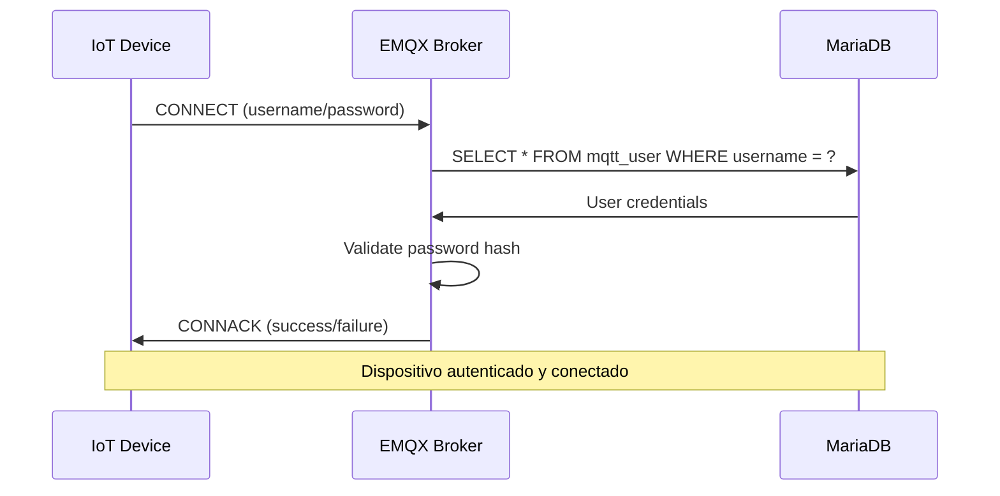
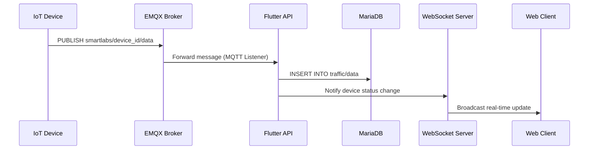
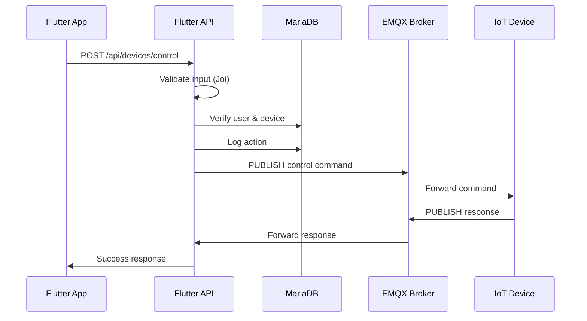
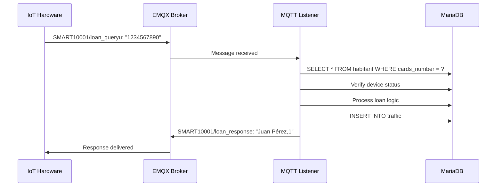

# Arquitectura Técnica - Sistema SMARTLABS

## Visión General de la Arquitectura

SMARTLABS implementa una arquitectura distribuida basada en microservicios que combina aplicaciones web tradicionales (PHP MVC), APIs REST modernas (Node.js), comunicación en tiempo real (WebSocket), y una infraestructura IoT robusta (Docker + EMQX + MariaDB).

## Diagrama de Arquitectura Completa

```
┌─────────────────────────────────────────────────────────────────────────────────┐
│                           SMARTLABS TECHNICAL ARCHITECTURE                     │
├─────────────────────────────────────────────────────────────────────────────────┤
│                                                                                 │
│  ┌─────────────────┐    ┌─────────────────┐    ┌─────────────────┐            │
│  │   Web Client    │    │  Mobile Apps    │    │   IoT Devices   │            │
│  │   (Browser)     │    │   (Flutter)     │    │   (ESP32/etc)   │            │
│  └─────────┬───────┘    └─────────┬───────┘    └─────────┬───────┘            │
│            │                      │                      │                    │
│            │ HTTP/WebSocket       │ HTTP/WebSocket       │ MQTT/WebSocket     │
│            │                      │                      │                    │
│  ┌─────────▼──────────────────────▼──────────────────────▼───────┐            │
│  │                    APPLICATION LAYER                           │            │
│  │                                                                 │            │
│  │  ┌─────────────────┐  ┌─────────────────┐  ┌─────────────────┐ │            │
│  │  │   PHP Web App   │  │  Flutter API    │  │ WebSocket Server│ │            │
│  │  │   (MVC)         │  │  (Node.js)      │  │  (Node.js)      │ │            │
│  │  │                 │  │                 │  │                 │ │            │
│  │  │ • Dashboard     │  │ • REST API      │  │ • Real-time     │ │            │
│  │  │ • User Auth     │  │ • MQTT Bridge   │  │ • Device Status │ │            │
│  │  │ • Device Mgmt   │  │ • JWT Auth      │  │ • Monitoring    │ │            │
│  │  │ • Reports       │  │ • Validation    │  │ • Alerts        │ │            │
│  │  └─────────────────┘  └─────────────────┘  └─────────────────┘ │            │
│  └─────────────────────────────────────────────────────────────────┘            │
│                                                                                 │
│  ┌─────────────────────────────────────────────────────────────────┐            │
│  │                    DOCKER INFRASTRUCTURE                       │            │
│  │                                                                 │            │
│  │  ┌─────────────────┐  ┌─────────────────┐  ┌─────────────────┐ │            │
│  │  │      EMQX       │  │    MariaDB      │  │   phpMyAdmin    │ │            │
│  │  │   (Broker)      │◄─┤   (Database)    │◄─┤   (Admin UI)    │ │            │
│  │  │                 │  │                 │  │                 │ │            │
│  │  │ • MQTT Broker   │  │ • Data Storage  │  │ • DB Management │ │            │
│  │  │ • WebSocket     │  │ • User Auth     │  │ • Query Tool    │ │            │
│  │  │ • Dashboard     │  │ • Device Info   │  │ • Monitoring    │ │            │
│  │  │ • API Gateway   │  │ • Traffic Logs  │  │                 │ │            │
│  │  └─────────────────┘  └─────────────────┘  └─────────────────┘ │            │
│  └─────────────────────────────────────────────────────────────────┘            │
│                                                                                 │
└─────────────────────────────────────────────────────────────────────────────────┘
```

## Componentes Técnicos Detallados

### 1. Aplicación Web PHP (MVC)

#### Arquitectura MVC Personalizada

```
┌─────────────────────────────────────────────────────────────┐
│                    CLIENTE (Navegador)                     │
├─────────────────────────────────────────────────────────────┤
│  HTML5 + CSS3 + JavaScript + Bootstrap + AJAX              │
└─────────────────┬───────────────────────────────────────────┘
                  │ HTTP/HTTPS
┌─────────────────▼───────────────────────────────────────────┐
│                 SERVIDOR WEB (Apache)                      │
├─────────────────────────────────────────────────────────────┤
│  .htaccess (URL Rewriting) + mod_rewrite                   │
└─────────────────┬───────────────────────────────────────────┘
                  │
┌─────────────────▼───────────────────────────────────────────┐
│                CONTROLADOR FRONTAL                         │
├─────────────────────────────────────────────────────────────┤
│  index.php (Router + Autoloader)                           │
└─────────────────┬───────────────────────────────────────────┘
                  │
┌─────────────────▼───────────────────────────────────────────┐
│                   CAPA MVC                                  │
├─────────────────┬───────────────┬───────────────────────────┤
│   CONTROLADORES │    MODELOS    │         VISTAS            │
│                 │               │                           │
│ • AuthController│ • User        │ • auth/login.php          │
│ • Dashboard     │ • Device      │ • dashboard/index.php     │
│ • Device        │ • Traffic     │ • device/index.php        │
│ • Habitant      │ • Habitant    │ • layout/header.php       │
│ • Loan          │ • Loan        │ • layout/footer.php       │
│ • Stats         │ • Equipment   │ • habitant/index.php      │
└─────────────────┼───────────────┼───────────────────────────┘
                  │               │
┌─────────────────▼───────────────▼───────────────────────────┐
│                  CAPA DE DATOS                             │
├─────────────────────────────────────────────────────────────┤
│  Database.php (Singleton Pattern + MySQLi)                 │
└─────────────────┬───────────────────────────────────────────┘
                  │
┌─────────────────▼───────────────────────────────────────────┐
│                BASE DE DATOS MySQL                         │
├─────────────────────────────────────────────────────────────┤
│ • users         • devices       • traffic                  │
│ • habintants    • equipment      • loans                   │
│ • becarios      • cards                                    │
└─────────────────────────────────────────────────────────────┘
```

#### Patrones de Diseño Implementados

**1. Front Controller Pattern**
```php
// index.php - Punto de entrada único
define('BASE_PATH', __DIR__);
require_once 'app/core/autoload.php';
$router = new Router();
$router->route($_GET['url'] ?? '');
```

**2. Singleton Pattern**
```php
class Database {
    private static $instance = null;
    private $connection;
    
    public static function getInstance() {
        if (self::$instance === null) {
            self::$instance = new self();
        }
        return self::$instance;
    }
    
    public function query($sql, $params = []) {
        $stmt = $this->connection->prepare($sql);
        if ($params) {
            $stmt->bind_param($this->getTypes($params), ...$params);
        }
        $stmt->execute();
        return $stmt->get_result()->fetch_all(MYSQLI_ASSOC);
    }
}
```

**3. MVC Pattern**
```php
abstract class Controller {
    protected $db;
    
    public function __construct() {
        session_start();
        $this->db = Database::getInstance();
    }
    
    protected function requireAuth() {
        if (!isset($_SESSION['logged']) || !$_SESSION['logged']) {
            $this->redirect('Auth/login');
        }
    }
    
    protected function view($view, $data = []) {
        extract($data);
        require_once "app/views/{$view}.php";
    }
}
```

### 2. Flutter API (Node.js)

#### Arquitectura de Servicios

```
┌─────────────────┐    ┌─────────────────┐    ┌─────────────────┐
│   Flutter App   │    │   Web Client    │    │  Mobile Client  │
└─────────┬───────┘    └─────────┬───────┘    └─────────┬───────┘
          │                      │                      │
          └──────────────────────┼──────────────────────┘
                                 │
                    ┌────────────▼────────────┐
                    │    SMARTLABS API        │
                    │   (Express.js + CORS)   │
                    └────────────┬────────────┘
                                 │
              ┌──────────────────┼──────────────────┐
              │                  │                  │
    ┌─────────▼─────────┐ ┌──────▼──────┐ ┌────────▼────────┐
    │   User Service    │ │Device Service│ │ Prestamo Service│
    └─────────┬─────────┘ └──────┬──────┘ └────────┬────────┘
              │                  │                 │
              └──────────────────┼─────────────────┘
                                 │
                    ┌────────────▼────────────┐
                    │    Database Layer       │
                    │   (MySQL + Fallback)    │
                    └─────────────────────────┘
```

#### Patrones de Diseño

**1. Repository Pattern**
```javascript
class UserService {
  async getUserByRegistration(registration) {
    const connection = dbConfig.getConnection();
    const [rows] = await connection.execute(
      'SELECT * FROM habitant WHERE registration = ?',
      [registration]
    );
    return rows[0] || null;
  }
}
```

**2. Factory Pattern**
```javascript
class DatabaseConfig {
  async connect() {
    try {
      return await this.createConnection(this.primaryConfig);
    } catch (error) {
      return await this.createConnection(this.fallbackConfig);
    }
  }
}
```

**3. Middleware Pattern**
```javascript
app.use(helmet()); // Seguridad
app.use(cors());   // CORS
app.use(rateLimit()); // Rate limiting
app.use(express.json()); // Parsing JSON
app.use(requestLogger); // Logging
```

### 3. Servidor WebSocket (Node.js)

#### Arquitectura de Tiempo Real

```javascript
class DeviceStatusServer {
  constructor() {
    this.clients = new Map();
    this.deviceSubscriptions = new Map();
    this.dbConfig = new DatabaseConfig();
  }
  
  async handleConnection(ws) {
    const clientId = this.generateClientId();
    this.clients.set(clientId, {
      socket: ws,
      subscribedDevices: new Set()
    });
    
    ws.on('message', (data) => {
      this.handleMessage(clientId, JSON.parse(data));
    });
  }
  
  async monitorDevices() {
    setInterval(async () => {
      const devices = await this.getActiveDevices();
      this.broadcastDeviceStatus(devices);
    }, this.config.polling_interval);
  }
}
```

### 4. Infraestructura Docker

#### EMQX Broker (Núcleo de Comunicación)

**Configuración Técnica:**
```yaml
Puertos Expuestos:
  - 1883: MQTT TCP
  - 8883: MQTT SSL/TLS
  - 8073: WebSocket
  - 8074: WebSocket Secure
  - 18083: Dashboard HTTP
  - 18084: Dashboard HTTPS
  - 8081: Management API HTTP
  - 8082: Management API HTTPS

Plugins Habilitados:
  - emqx_auth_mysql: Autenticación basada en MySQL
  - emqx_dashboard: Interfaz web de administración
  - emqx_management: API de gestión
  - emqx_retainer: Retención de mensajes
  - emqx_recon: Reconexión automática
```

**Límites de Conexión:**
```
TCP: 1000 conexiones simultáneas
SSL: 1000 conexiones simultáneas
WebSocket: 1000 conexiones simultáneas
WebSocket Secure: 1000 conexiones simultáneas
```

#### MariaDB (Capa de Persistencia)

**Esquema de Base de Datos:**

```sql
-- Autenticación MQTT
CREATE TABLE mqtt_user (
  id INT PRIMARY KEY AUTO_INCREMENT,
  username VARCHAR(100) UNIQUE,
  password VARCHAR(100),
  salt VARCHAR(35),
  is_superuser TINYINT(1),
  created DATETIME
);

CREATE TABLE mqtt_acl (
  id INT PRIMARY KEY AUTO_INCREMENT,
  allow INT DEFAULT 0,
  ipaddr VARCHAR(60),
  username VARCHAR(100),
  clientid VARCHAR(100),
  access INT DEFAULT 3,
  topic VARCHAR(100)
);

-- Sistema SMARTLABS
CREATE TABLE users (
  users_id INT PRIMARY KEY AUTO_INCREMENT,
  users_date TIMESTAMP DEFAULT CURRENT_TIMESTAMP,
  users_email VARCHAR(60) NOT NULL,
  users_password VARCHAR(60) NOT NULL
);

CREATE TABLE devices (
  devices_id INT PRIMARY KEY AUTO_INCREMENT,
  devices_date TIMESTAMP DEFAULT CURRENT_TIMESTAMP,
  devices_alias VARCHAR(50) NOT NULL,
  devices_serie VARCHAR(50) NOT NULL,
  devices_user_id INT NOT NULL
);

CREATE TABLE habintants (
  hab_id INT PRIMARY KEY AUTO_INCREMENT,
  hab_date TIMESTAMP DEFAULT CURRENT_TIMESTAMP,
  hab_name VARCHAR(50) NOT NULL,
  hab_registration VARCHAR(50) UNIQUE,
  hab_email VARCHAR(50) NOT NULL,
  hab_card_id INT NOT NULL,
  hab_device_id INT NOT NULL
);

CREATE TABLE traffic (
  traffic_id INT PRIMARY KEY AUTO_INCREMENT,
  traffic_date TIMESTAMP DEFAULT CURRENT_TIMESTAMP,
  traffic_hab_id INT NOT NULL,
  traffic_device VARCHAR(50) NOT NULL,
  traffic_state BOOLEAN NOT NULL
);
```

## Flujos de Datos del Sistema

### 1. Flujo de Autenticación de Dispositivos IoT



### 2. Flujo de Publicación de Datos IoT



### 3. Flujo de Control de Dispositivo (App → Hardware)



### 4. Flujo de Consulta MQTT (Hardware → API → Database)



## Configuración de Red y Comunicación

### Red Docker Personalizada

```yaml
networks:
  iot:
    name: iot_host
    driver: bridge
    
Aliases de Red:
  - mariadb_host → Contenedor MariaDB
  - emqx_host → Contenedor EMQX
  - phpmyadmin_host → Contenedor phpMyAdmin
```

### Comunicación Inter-Servicios

```
EMQX ←→ MariaDB:
  - Host: mariadb_host:3306
  - Protocolo: MySQL/TCP
  - Autenticación: emqxuser/emqxpass
  - Base de datos: emqx

Flutter API ←→ MariaDB:
  - Host: localhost:4000
  - Protocolo: MySQL/TCP
  - Pool de conexiones: 10
  - Fallback automático

WebSocket Server ←→ MariaDB:
  - Host: localhost:4000
  - Protocolo: MySQL/TCP
  - Polling interval: 5000ms
```

### Tópicos MQTT

**Entrada (Hardware → Sistema):**
- `SMART{XXXXX}/loan_queryu` - Consultas de usuario
- `SMART{XXXXX}/loan_querye` - Consultas de equipo
- `SMART{XXXXX}/access_query` - Consultas de acceso
- `values` - Datos de sensores
- `smartlabs/{device_id}/data` - Datos generales

**Salida (Sistema → Hardware):**
- `SMART{XXXXX}/loan_response` - Respuestas de préstamo
- `SMART{XXXXX}/access_response` - Respuestas de acceso
- `smartlabs/{device_id}/control` - Comandos de control

## Seguridad y Autenticación

### Niveles de Seguridad

#### 1. Autenticación MQTT
```
Nivel 1: Autenticación de Usuario
  - Username/Password en base de datos
  - Hash SHA256 para contraseñas
  - Validación contra tabla mqtt_user

Nivel 2: Control de Acceso (ACL)
  - Permisos por topic
  - Restricciones por IP
  - Control de publicación/suscripción
```

#### 2. Autenticación Web (PHP)
```php
// Autenticación de sesión
protected function requireAuth() {
    if (!isset($_SESSION['logged']) || !$_SESSION['logged']) {
        $this->redirect('Auth/login');
        exit();
    }
}

// Sanitización de datos
protected function sanitize($data) {
    return htmlspecialchars(strip_tags(trim($data)), ENT_QUOTES, 'UTF-8');
}
```

#### 3. Validación API (Node.js)
```javascript
// Validación con Joi
const schema = Joi.object({
  registration: Joi.string().required().min(1).max(50),
  device_serie: Joi.string().required().min(1).max(50),
  action: Joi.number().integer().valid(0, 1).required()
});

// Rate limiting
const limiter = rateLimit({
  windowMs: 15 * 60 * 1000, // 15 minutos
  max: 100, // máximo 100 requests
  message: {
    success: false,
    message: 'Demasiadas solicitudes'
  }
});
```

#### 4. Seguridad de Base de Datos
```sql
-- Prepared statements (PHP)
$stmt = $this->connection->prepare($sql);
if ($params) {
    $stmt->bind_param($this->getTypes($params), ...$params);
}
$stmt->execute();

-- Prepared statements (Node.js)
const [rows] = await connection.execute(
  'SELECT * FROM habitant WHERE registration = ?',
  [registration]
);
```

## Volúmenes Persistentes y Almacenamiento

### Configuración de Volúmenes

```yaml
volumes:
  # Datos de EMQX
  vol-emqx-data:
    name: foo-emqx-data
    mountpoint: /opt/emqx/data
    
  # Configuración de EMQX
  vol-emqx-etc:
    name: foo-emqx-etc
    mountpoint: /opt/emqx/etc
    
  # Logs de EMQX
  vol-emqx-log:
    name: foo-emqx-log
    mountpoint: /opt/emqx/log
    
  # Datos de MariaDB
  mariadb:
    driver: local
    mountpoint: /var/lib/mysql
```

### Estrategia de Backup

```bash
#!/bin/bash
# Script de backup automático

# Backup de MariaDB
docker-compose exec mariadb mysqldump -u root -pemqxpass emqx > backup_$(date +%Y%m%d_%H%M%S).sql

# Backup de volúmenes EMQX
docker run --rm -v foo-emqx-data:/data -v $(pwd):/backup alpine tar czf /backup/emqx_data_$(date +%Y%m%d_%H%M%S).tar.gz -C /data .

# Backup de configuración
cp docker-compose.yaml backup/
cp .env backup/
```

## Monitoreo y Observabilidad

### Métricas del Sistema

#### EMQX Metrics
```
Conexiones:
  - Conexiones activas
  - Conexiones por segundo
  - Desconexiones

Mensajes:
  - Mensajes publicados
  - Mensajes entregados
  - Mensajes retenidos
  - Cola de mensajes

Sesiones:
  - Sesiones activas
  - Sesiones persistentes
  - Suscripciones activas
```

#### Application Logging

**PHP Logging:**
```php
class Logger {
    public static function log($level, $message, $context = []) {
        $timestamp = date('Y-m-d H:i:s');
        $log = "[{$timestamp}] {$level}: {$message}";
        
        if ($context) {
            $log .= ' ' . json_encode($context);
        }
        
        error_log($log, 3, '/var/log/smartlabs.log');
    }
}
```

**Node.js Logging:**
```javascript
class Logger {
  static info(message, data = {}) {
    console.log(`ℹ️ [${new Date().toISOString()}] ${message}`, data);
  }
  
  static error(message, error = {}) {
    console.error(`❌ [${new Date().toISOString()}] ${message}`, error);
  }
}
```

### Health Checks

**PHP Health Check:**
```php
class HealthCheck {
    public static function database() {
        try {
            $db = Database::getInstance();
            $db->query("SELECT 1");
            return true;
        } catch (Exception $e) {
            return false;
        }
    }
}
```

**Node.js Health Check:**
```javascript
app.get('/health', async (req, res) => {
  const health = {
    status: 'healthy',
    timestamp: new Date().toISOString(),
    services: {
      database: await checkDatabaseHealth(),
      mqtt: await checkMQTTHealth()
    }
  };
  
  res.json({ success: true, data: health });
});
```

## Escalabilidad y Rendimiento

### Optimizaciones Actuales

#### EMQX Configuration
```
Límites de Conexión:
  - listener.tcp.external.max_connections = 1000
  - listener.ssl.external.max_connections = 1000
  - listener.ws.external.max_connections = 1000
  - listener.wss.external.max_connections = 1000
```

#### Database Optimization
```sql
-- Índices para consultas frecuentes
CREATE INDEX idx_habitant_registration ON habitant(registration);
CREATE INDEX idx_habitant_cards_number ON habitant(cards_number);
CREATE INDEX idx_device_serie ON device(serie);
CREATE INDEX idx_traffic_timestamp ON traffic(timestamp);
```

#### Caching Strategy (Node.js)
```javascript
class CacheService {
  constructor() {
    this.cache = new Map();
    this.ttl = 5 * 60 * 1000; // 5 minutos
  }
  
  get(key) {
    const item = this.cache.get(key);
    if (item && Date.now() < item.expiry) {
      return item.value;
    }
    this.cache.delete(key);
    return null;
  }
  
  set(key, value) {
    this.cache.set(key, {
      value,
      expiry: Date.now() + this.ttl
    });
  }
}
```

### Estrategias de Escalamiento

#### Escalamiento Horizontal
```
EMQX Cluster:
  - Múltiples nodos EMQX
  - Load balancer (HAProxy/Nginx)
  - Shared storage para configuración

MariaDB Cluster:
  - Master-Slave replication
  - Galera Cluster
  - Read replicas

Application Layer:
  - Multiple PHP instances
  - Node.js cluster mode
  - Load balancer
```

#### Escalamiento Vertical
```
Recursos de Contenedor:
  - CPU: 2-4 cores por servicio
  - RAM: 2-8GB por servicio
  - Storage: SSD para mejor rendimiento
```

## Integración con Sistemas Externos

### API Externa (PHP)
```php
class DeviceAPI {
    public function getStatus($deviceId) {
        // Conexión a base de datos externa
        $external_db = new mysqli('192.168.0.100', 'root', 'pass', 'emqx', 4000);
        
        $result = $external_db->query(
            "SELECT * FROM device_status WHERE device_id = '{$deviceId}'"
        );
        
        return $result->fetch_assoc();
    }
}
```

### WebSocket para Tiempo Real
```javascript
// Cliente JavaScript
const ws = new WebSocket('ws://localhost:8080');
ws.onmessage = function(event) {
    const data = JSON.parse(event.data);
    updateDashboard(data);
};
```

## Consideraciones de Deployment

### Entorno de Desarrollo
```bash
# Laragon (Windows)
c:\laragon\www\smartlabs

# Docker
docker-compose up -d
```

### Entorno de Producción
```apache
# VirtualHost Apache
<VirtualHost *:80>
    ServerName smartlabs.com
    DocumentRoot /var/www/smartlabs
    
    <Directory /var/www/smartlabs>
        AllowOverride All
        Require all granted
    </Directory>
</VirtualHost>
```

### Optimizaciones de Producción
- **OPcache**: Para acelerar PHP
- **Gzip compression**: Para reducir transferencia
- **CDN**: Para archivos estáticos
- **Load balancer**: Para múltiples instancias
- **SSL/TLS**: Certificados válidos
- **Process Management**: PM2 para Node.js

## Correcciones de Errores Críticos

### TypeError: Bind parameters must not contain undefined (Enero 2025)

**Problema identificado:**
Error en el servicio de préstamos cuando usuarios no tenían RFID asignado, causando fallos en consultas SQL.

**Solución implementada:**
```javascript
// Antes: getUserByRegistration solo consultaba tabla habitant
const query = 'SELECT * FROM habitant WHERE hab_registration = ?';

// Después: Incluye información de tarjetas RFID
const query = `
    SELECT h.*, c.cards_number, c.cards_assigned 
    FROM habitant h 
    LEFT JOIN cards_habs c ON h.hab_id = c.hab_id 
    WHERE h.hab_registration = ?
`;

// Validación agregada
if (!userRFID) {
    return {
        success: false,
        message: 'Usuario no tiene RFID asignado',
        action: 'no_rfid'
    };
}
```

**Archivos modificados:**
- `flutter-api/src/services/prestamoService.js`
  - Método `getUserByRegistration()`: Mejorado para incluir datos RFID
  - Método `procesarPrestamo()`: Validación de RFID antes de uso
  - Método `handleLoanEquipmentQuery()`: Logging y validación mejorados

**Impacto:**
- ✅ Eliminación completa del error TypeError
- ✅ Manejo robusto de usuarios sin RFID
- ✅ Logging detallado para debugging
- ✅ Mejor experiencia de usuario en la app móvil

## Roadmap Técnico

### Corto Plazo
- [x] ~~Corrección TypeError en prestamoService~~ ✅ Completado
- [ ] Implementación completa de SSL/TLS
- [ ] Migrar de SHA1 a bcrypt
- [ ] Implementar CSRF protection
- [ ] Clustering EMQX
- [ ] Optimización de consultas de base de datos

### Mediano Plazo
- [ ] Implementar API REST completa en PHP
- [ ] Microservicios con API Gateway
- [ ] Sistema de caché distribuido (Redis)
- [ ] Monitoreo con Prometheus/Grafana
- [ ] CI/CD pipeline
- [ ] Tests unitarios y de integración

### Largo Plazo
- [ ] Migración a Kubernetes
- [ ] Machine Learning para análisis predictivo
- [ ] Edge computing para dispositivos IoT
- [ ] Blockchain para trazabilidad
- [ ] Migrar PHP a framework moderno (Laravel/Symfony)
- [ ] Implementar Event Sourcing

---

**Documento técnico desarrollado por**: Equipo SMARTLABS  
**Última actualización**: Diciembre 2024  
**Versión**: 2.0.0