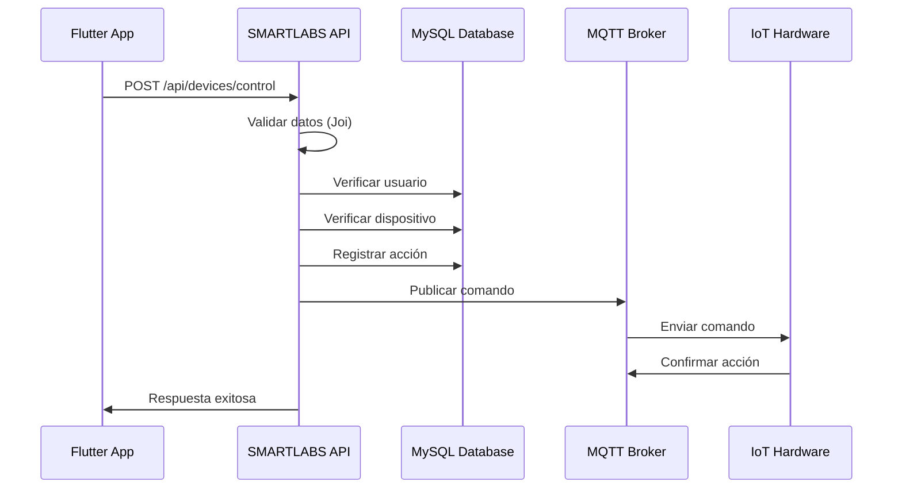
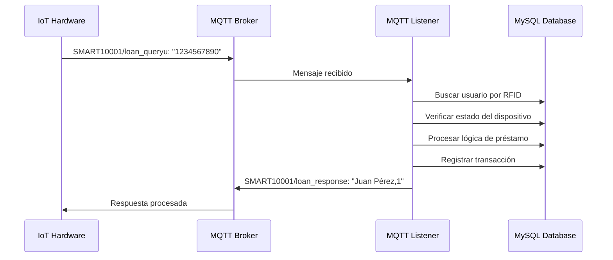
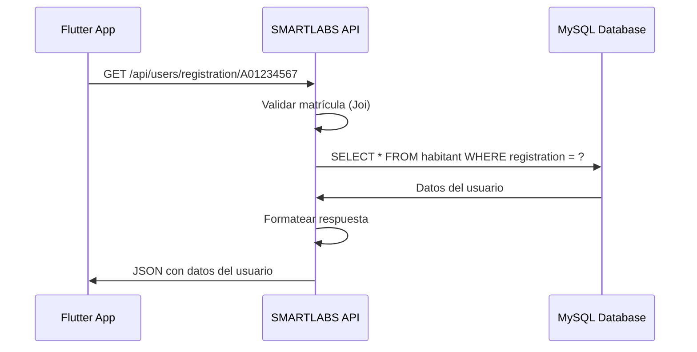

# Arquitectura del Sistema - SMARTLABS Flutter API

## Visión General

La SMARTLABS Flutter API es un sistema distribuido que conecta aplicaciones Flutter con dispositivos IoT a través de comunicación MQTT y gestiona datos en una base de datos MySQL. El sistema está diseñado para ser escalable, resiliente y fácil de mantener.

## Diagrama de Arquitectura

```
┌─────────────────┐    ┌─────────────────┐    ┌─────────────────┐
│   Flutter App   │    │   Web Client    │    │  Mobile Client  │
└─────────┬───────┘    └─────────┬───────┘    └─────────┬───────┘
          │                      │                      │
          └──────────────────────┼──────────────────────┘
                                 │
                    ┌────────────▼────────────┐
                    │    SMARTLABS API        │
                    │   (Express.js + CORS)   │
                    └────────────┬────────────┘
                                 │
              ┌──────────────────┼──────────────────┐
              │                  │                  │
    ┌─────────▼─────────┐ ┌──────▼──────┐ ┌────────▼────────┐
    │   User Service    │ │Device Service│ │ Prestamo Service│
    └─────────┬─────────┘ └──────┬──────┘ └────────┬────────┘
              │                  │                 │
              └──────────────────┼─────────────────┘
                                 │
                    ┌────────────▼────────────┐
                    │    Database Layer       │
                    │   (MySQL + Fallback)    │
                    └─────────────────────────┘

                    ┌─────────────────────────┐
                    │    MQTT Listener        │
                    │   (Hardware Bridge)     │
                    └────────────┬────────────┘
                                 │
                    ┌────────────▼────────────┐
                    │     MQTT Broker         │
                    │       (EMQX)            │
                    └────────────┬────────────┘
                                 │
              ┌──────────────────┼──────────────────┐
              │                  │                  │
    ┌─────────▼─────────┐ ┌──────▼──────┐ ┌────────▼────────┐
    │   IoT Device 1    │ │IoT Device 2 │ │   IoT Device N  │
    │   (SMART10001)    │ │(SMART10002) │ │  (SMART1000N)   │
    └───────────────────┘ └─────────────┘ └─────────────────┘
```

## Componentes del Sistema

### 1. API Layer (Express.js)

#### Responsabilidades:
- Manejo de requests HTTP/HTTPS
- Autenticación y autorización
- Validación de datos de entrada
- Rate limiting y seguridad
- Respuestas estandarizadas

#### Tecnologías:
- **Express.js**: Framework web
- **Helmet**: Seguridad HTTP
- **CORS**: Cross-Origin Resource Sharing
- **Joi**: Validación de esquemas
- **express-rate-limit**: Control de tasa

### 2. Service Layer

#### User Service
```javascript
class UserService {
  // Gestión de usuarios
  async getUserByRegistration(registration)
  async getUserByRFID(rfid)
  async validateUser(registration)
  async getUserAccessHistory(userId, limit)
}
```

#### Device Service
```javascript
class DeviceService {
  // Gestión de dispositivos
  async getDeviceBySerial(serie)
  async controlDevice(serie, userId, userName, action)
  async getDeviceHistory(serie, limit)
  async getAllDevices()
}
```

#### Prestamo Service
```javascript
class PrestamoService {
  // Gestión de préstamos
  async procesarPrestamo(registration, deviceSerie, action)
  async handleLoanUserQuery(serialNumber, rfidNumber)
  async simularDispositivoFisico(registration, deviceSerie)
}
```

### 3. Data Layer

#### Database Configuration
```javascript
class DatabaseConfig {
  constructor() {
    this.primaryConfig = { /* Configuración principal */ }
    this.fallbackConfig = { /* Configuración fallback */ }
  }
  
  async connect() {
    // Intenta conexión principal, fallback automático
  }
}
```

#### Tablas Principales:

**habitant** (Usuarios)
```sql
CREATE TABLE habitant (
  id INT PRIMARY KEY AUTO_INCREMENT,
  name VARCHAR(255) NOT NULL,
  registration VARCHAR(50) UNIQUE NOT NULL,
  email VARCHAR(255),
  cards_number VARCHAR(50),
  device_id INT,
  created_at TIMESTAMP DEFAULT CURRENT_TIMESTAMP
);
```

**device** (Dispositivos)
```sql
CREATE TABLE device (
  id INT PRIMARY KEY AUTO_INCREMENT,
  alias VARCHAR(255) NOT NULL,
  serie VARCHAR(50) UNIQUE NOT NULL,
  date TIMESTAMP DEFAULT CURRENT_TIMESTAMP,
  status TINYINT DEFAULT 0
);
```

**traffic** (Historial de Accesos)
```sql
CREATE TABLE traffic (
  id INT PRIMARY KEY AUTO_INCREMENT,
  habitant_id INT,
  device_id INT,
  action VARCHAR(10),
  timestamp TIMESTAMP DEFAULT CURRENT_TIMESTAMP,
  FOREIGN KEY (habitant_id) REFERENCES habitant(id),
  FOREIGN KEY (device_id) REFERENCES device(id)
);
```

### 4. MQTT Layer

#### MQTT Listener Service
```javascript
class MQTTListenerService {
  // Escucha mensajes del hardware
  async handleLoanUserQuery(serialNumber, rfidNumber)
  async handleLoanEquipmentQuery(serialNumber, equipRfid)
  async handleAccessQuery(serialNumber, message)
  async publishMQTTCommand(serialNumber, userName, action)
}
```

#### Tópicos MQTT:

**Entrada (Hardware → API):**
- `SMART{XXXXX}/loan_queryu`: Consultas de usuario
- `SMART{XXXXX}/loan_querye`: Consultas de equipo
- `SMART{XXXXX}/access_query`: Consultas de acceso
- `values`: Datos de sensores

**Salida (API → Hardware):**
- `SMART{XXXXX}/loan_response`: Respuestas de préstamo
- `SMART{XXXXX}/access_response`: Respuestas de acceso

## Flujos de Datos

### 1. Flujo de Control de Dispositivo (App → API → Hardware)



### 2. Flujo MQTT (Hardware → API → Database)



### 3. Flujo de Consulta de Usuario



## Patrones de Diseño

### 1. Repository Pattern

Cada servicio actúa como un repositorio que encapsula la lógica de acceso a datos:

```javascript
class UserService {
  async getUserByRegistration(registration) {
    const connection = dbConfig.getConnection();
    const [rows] = await connection.execute(
      'SELECT * FROM habitant WHERE registration = ?',
      [registration]
    );
    return rows[0] || null;
  }
}
```

### 2. Factory Pattern

La configuración de base de datos utiliza el patrón factory para crear conexiones:

```javascript
class DatabaseConfig {
  async connect() {
    try {
      return await this.createConnection(this.primaryConfig);
    } catch (error) {
      return await this.createConnection(this.fallbackConfig);
    }
  }
}
```

### 3. Observer Pattern

El MQTT Listener implementa el patrón observer para manejar mensajes:

```javascript
class MQTTListenerService {
  constructor() {
    this.messageHandlers = new Map();
  }
  
  subscribe(topic, callback) {
    this.messageHandlers.set(topic, callback);
  }
}
```

### 4. Middleware Pattern

Express.js utiliza middleware para procesar requests:

```javascript
app.use(helmet()); // Seguridad
app.use(cors());   // CORS
app.use(rateLimit()); // Rate limiting
app.use(express.json()); // Parsing JSON
app.use(requestLogger); // Logging
```

## Estrategias de Resilencia

### 1. Database Fallback

```javascript
async connect() {
  try {
    // Intentar conexión principal
    this.connection = await mysql.createConnection(this.primaryConfig);
  } catch (error) {
    // Fallback automático
    this.connection = await mysql.createConnection(this.fallbackConfig);
  }
}
```

### 2. MQTT Reconnection

```javascript
const mqttOptions = {
  reconnectPeriod: 1000, // Reconectar cada segundo
  connectTimeout: 4000,  // Timeout de conexión
  clean: true           // Sesión limpia
};
```

### 3. Error Handling

```javascript
class ErrorHandler {
  static handle(error, req, res, next) {
    console.error('Error:', error);
    
    if (error.name === 'ValidationError') {
      return res.status(400).json({
        success: false,
        message: 'Datos inválidos',
        error: error.message
      });
    }
    
    res.status(500).json({
      success: false,
      message: 'Error interno del servidor'
    });
  }
}
```

### 4. Rate Limiting

```javascript
const limiter = rateLimit({
  windowMs: 15 * 60 * 1000, // 15 minutos
  max: 100, // máximo 100 requests
  message: {
    success: false,
    message: 'Demasiadas solicitudes'
  }
});
```

## Seguridad

### 1. Input Validation

```javascript
const schema = Joi.object({
  registration: Joi.string().required().min(1).max(50),
  device_serie: Joi.string().required().min(1).max(50),
  action: Joi.number().integer().valid(0, 1).required()
});
```

### 2. SQL Injection Prevention

```javascript
// Usar prepared statements
const [rows] = await connection.execute(
  'SELECT * FROM habitant WHERE registration = ?',
  [registration] // Parámetros seguros
);
```

### 3. CORS Configuration

```javascript
const corsOptions = {
  origin: [
    'http://localhost:3000',
    /^http:\/\/localhost:\d+$/
  ],
  methods: ['GET', 'POST', 'PUT', 'DELETE'],
  allowedHeaders: ['Content-Type', 'Authorization']
};
```

### 4. Headers de Seguridad

```javascript
app.use(helmet({
  crossOriginResourcePolicy: { policy: "cross-origin" },
  contentSecurityPolicy: {
    directives: {
      defaultSrc: ["'self'"],
      scriptSrc: ["'self'", "'unsafe-inline'"]
    }
  }
}));
```

## Escalabilidad

### 1. Horizontal Scaling

- **Load Balancer**: Nginx o HAProxy
- **Multiple Instances**: PM2 cluster mode
- **Database Clustering**: MySQL Master-Slave

### 2. Caching Strategy

```javascript
class CacheService {
  constructor() {
    this.cache = new Map();
    this.ttl = 5 * 60 * 1000; // 5 minutos
  }
  
  get(key) {
    const item = this.cache.get(key);
    if (item && Date.now() < item.expiry) {
      return item.value;
    }
    this.cache.delete(key);
    return null;
  }
  
  set(key, value) {
    this.cache.set(key, {
      value,
      expiry: Date.now() + this.ttl
    });
  }
}
```

### 3. Database Optimization

```sql
-- Índices para consultas frecuentes
CREATE INDEX idx_habitant_registration ON habitant(registration);
CREATE INDEX idx_habitant_cards_number ON habitant(cards_number);
CREATE INDEX idx_device_serie ON device(serie);
CREATE INDEX idx_traffic_timestamp ON traffic(timestamp);
```

## Monitoreo y Logging

### 1. Application Logging

```javascript
class Logger {
  static info(message, data = {}) {
    console.log(`ℹ️ [${new Date().toISOString()}] ${message}`, data);
  }
  
  static error(message, error = {}) {
    console.error(`❌ [${new Date().toISOString()}] ${message}`, error);
  }
  
  static success(message, data = {}) {
    console.log(`✅ [${new Date().toISOString()}] ${message}`, data);
  }
}
```

### 2. Health Checks

```javascript
app.get('/health', async (req, res) => {
  const health = {
    status: 'healthy',
    timestamp: new Date().toISOString(),
    services: {
      database: await checkDatabaseHealth(),
      mqtt: await checkMQTTHealth()
    }
  };
  
  res.json({ success: true, data: health });
});
```

### 3. Metrics Collection

```javascript
class MetricsCollector {
  constructor() {
    this.metrics = {
      requests: 0,
      errors: 0,
      mqttMessages: 0,
      dbQueries: 0
    };
  }
  
  incrementRequest() {
    this.metrics.requests++;
  }
  
  getMetrics() {
    return { ...this.metrics };
  }
}
```

## Deployment

### 1. Docker Configuration

```dockerfile
FROM node:18-alpine

WORKDIR /app

COPY package*.json ./
RUN npm ci --only=production

COPY src/ ./src/

EXPOSE 3000

CMD ["npm", "start"]
```

### 2. Docker Compose

```yaml
version: '3.8'
services:
  api:
    build: .
    ports:
      - "3000:3000"
    environment:
      - NODE_ENV=production
      - DB_HOST=mysql
      - MQTT_HOST=emqx
    depends_on:
      - mysql
      - emqx
  
  mysql:
    image: mysql:8.0
    environment:
      MYSQL_ROOT_PASSWORD: rootpass
      MYSQL_DATABASE: smartlabs
    volumes:
      - mysql_data:/var/lib/mysql
  
  emqx:
    image: emqx/emqx:latest
    ports:
      - "1883:1883"
      - "8083:8083"

volumes:
  mysql_data:
```

### 3. Production Considerations

- **Environment Variables**: Usar secretos seguros
- **SSL/TLS**: Certificados válidos
- **Reverse Proxy**: Nginx con SSL termination
- **Process Management**: PM2 o similar
- **Monitoring**: Prometheus + Grafana
- **Logging**: ELK Stack o similar

## Conclusión

La arquitectura de SMARTLABS Flutter API está diseñada para ser:

- **Modular**: Componentes independientes y reutilizables
- **Escalable**: Soporta crecimiento horizontal y vertical
- **Resiliente**: Manejo robusto de errores y fallbacks
- **Segura**: Múltiples capas de seguridad
- **Mantenible**: Código limpio y bien documentado

Esta arquitectura permite una integración fluida entre aplicaciones Flutter, dispositivos IoT y sistemas de gestión de datos, proporcionando una base sólida para el ecosistema SMARTLABS.