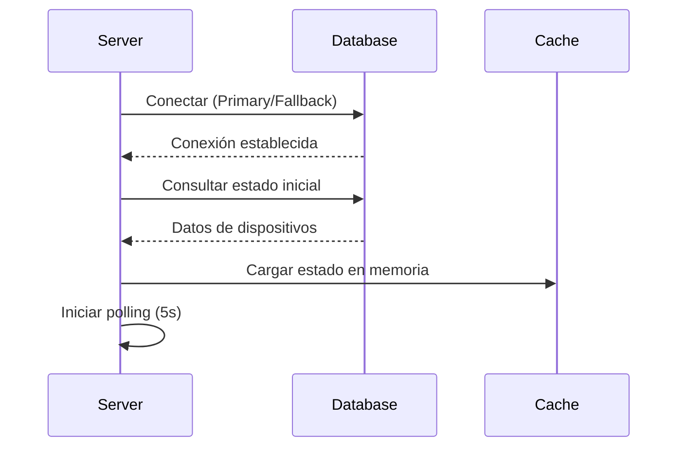
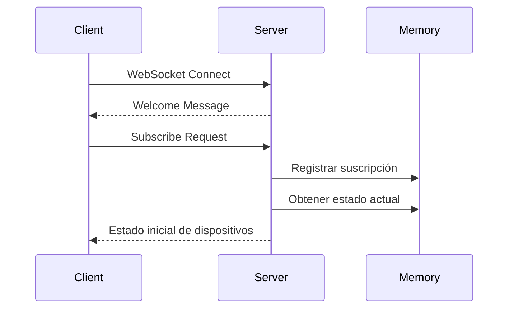
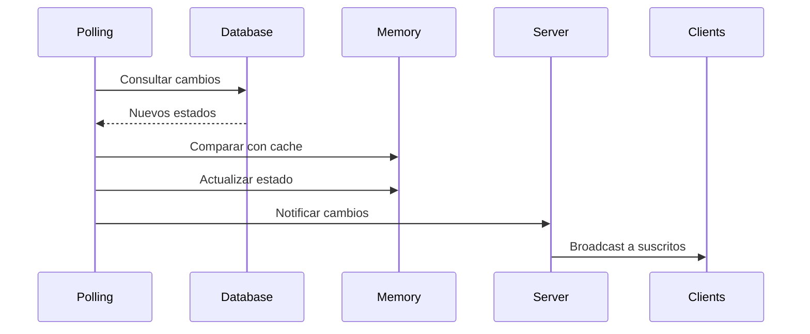

# Arquitectura del Sistema de Monitoreo de Dispositivos

## Visión General

El **SMARTLABS Device Status Server** es un servicio de monitoreo en tiempo real que utiliza WebSockets para proporcionar actualizaciones instantáneas del estado de dispositivos IoT conectados al sistema SMARTLABS.

## Diagrama de Arquitectura

```
┌─────────────────┐    ┌─────────────────┐    ┌─────────────────┐
│   Frontend      │    │   WebSocket     │    │   Database      │
│   Clients       │◄──►│   Server        │◄──►│   MySQL         │
│                 │    │                 │    │                 │
│ • Web Apps      │    │ • Node.js       │    │ • Primary DB    │
│ • Mobile Apps   │    │ • ws Library    │    │ • Fallback DB   │
│ • Dashboards    │    │ • HTTP Server   │    │ • Traffic Table │
└─────────────────┘    └─────────────────┘    └─────────────────┘
         │                       │                       │
         │                       │                       │
         ▼                       ▼                       ▼
┌─────────────────┐    ┌─────────────────┐    ┌─────────────────┐
│   Real-time     │    │   Polling       │    │   Data          │
│   Updates       │    │   System        │    │   Persistence   │
│                 │    │                 │    │                 │
│ • Device Status │    │ • 5s Interval   │    │ • Device State  │
│ • User Info     │    │ • Batch Queries │    │ • User Activity │
│ • Timestamps    │    │ • Error Handling│    │ • Timestamps    │
└─────────────────┘    └─────────────────┘    └─────────────────┘
```

## Componentes del Sistema

### 1. WebSocket Server

**Ubicación**: `src/services/device-status/server.js`

**Responsabilidades**:
- Gestionar conexiones WebSocket de clientes
- Mantener estado en memoria de dispositivos
- Distribuir actualizaciones a clientes suscritos
- Manejar suscripciones selectivas

**Tecnologías**:
- Node.js HTTP Server
- WebSocket (ws) Library
- Event-driven Architecture

### 2. Sistema de Polling

**Funcionamiento**:
```javascript
// Consulta cada 5 segundos (configurable)
setInterval(checkAllDevicesStatus, deviceConfig.monitoring.pollingInterval);

// Query optimizada para obtener último estado
const query = `
    SELECT t.traffic_device, t.traffic_state, t.traffic_date, 
           h.hab_name, h.hab_registration, h.hab_email
    FROM traffic t
    LEFT JOIN habintants h ON t.traffic_hab_id = h.hab_id
    WHERE (t.traffic_device, t.traffic_date) IN (
        SELECT traffic_device, MAX(traffic_date) 
        FROM traffic 
        GROUP BY traffic_device
    )
`;
```

### 3. Gestión de Base de Datos

**Configuración Dual**:
- **Primary Database**: Base de datos externa (192.168.0.100:4000)
- **Fallback Database**: Base de datos local (localhost:3306)

**Estrategia de Conexión**:
```javascript
async function connectToDatabase() {
    try {
        // Intentar conexión principal
        const connection = await mysql.createConnection(primaryDbConfig);
        return connection;
    } catch (error) {
        // Fallback automático
        const connection = await mysql.createConnection(fallbackDbConfig);
        return connection;
    }
}
```

### 4. Sistema de Suscripciones

**Gestión de Clientes**:
```javascript
const clients = new Map(); // WebSocket -> [deviceIds]

// Suscripción selectiva
if (data.type === 'subscribe') {
    const deviceIds = data.devices || [];
    clients.set(ws, deviceIds);
}

// Broadcast inteligente
function broadcastDeviceStatus(deviceId, status) {
    wss.clients.forEach(client => {
        const clientDevices = clients.get(client) || [];
        if (clientDevices.includes(deviceId) || clientDevices.includes('all')) {
            client.send(JSON.stringify({...}));
        }
    });
}
```

## Flujo de Datos

### 1. Inicialización del Sistema



### 2. Conexión de Cliente



### 3. Actualización de Estado



## Patrones de Diseño

### 1. Observer Pattern

**Implementación**:
```javascript
// Sujeto: Sistema de polling
// Observadores: Clientes WebSocket suscritos

function broadcastDeviceStatus(deviceId, status) {
    // Notificar solo a observadores interesados
    wss.clients.forEach(client => {
        if (isSubscribed(client, deviceId)) {
            client.send(JSON.stringify({...}));
        }
    });
}
```

### 2. Strategy Pattern

**Configuración de Base de Datos**:
```javascript
// Estrategia de conexión con fallback
class DatabaseStrategy {
    async connect() {
        try {
            return await this.connectPrimary();
        } catch (error) {
            return await this.connectFallback();
        }
    }
}
```

### 3. Singleton Pattern

**Estado Global**:
```javascript
// Estado único compartido
const deviceStatus = {}; // Singleton para estado de dispositivos
const clients = new Map(); // Singleton para gestión de clientes
```

## Configuración y Escalabilidad

### Configuración Modular

**Database Config** (`src/config/database.js`):
```javascript
module.exports = {
    primary: { /* configuración principal */ },
    fallback: { /* configuración de respaldo */ },
    pool: { /* configuración de pool */ },
    reconnection: { /* configuración de reconexión */ }
};
```

**Service Config** (`src/config/device-status.js`):
```javascript
module.exports = {
    websocket: { /* configuración WebSocket */ },
    monitoring: { /* configuración de polling */ },
    logging: { /* configuración de logs */ },
    ui: { /* configuración de interfaz */ }
};
```

### Escalabilidad Horizontal

**Consideraciones**:
1. **Load Balancing**: Nginx con sticky sessions
2. **Database Clustering**: MySQL Master-Slave
3. **Redis**: Para estado compartido entre instancias
4. **Message Queue**: Para comunicación entre servicios

**Ejemplo de configuración con Redis**:
```javascript
const redis = require('redis');
const client = redis.createClient();

// Compartir estado entre instancias
async function updateDeviceStatus(deviceId, status) {
    await client.hset('device_status', deviceId, JSON.stringify(status));
    // Publicar cambio a otras instancias
    await client.publish('device_updates', JSON.stringify({deviceId, status}));
}
```

## Optimizaciones de Rendimiento

### 1. Query Optimization

**Índices Recomendados**:
```sql
-- Optimizar consulta principal
CREATE INDEX idx_traffic_device_date ON traffic(traffic_device, traffic_date);
CREATE INDEX idx_traffic_date_desc ON traffic(traffic_date DESC);
CREATE INDEX idx_habitant_id ON habintants(hab_id);
```

**Query Optimizada**:
```sql
-- Usar window functions para mejor rendimiento
SELECT 
    traffic_device,
    traffic_state,
    traffic_date,
    hab_name,
    hab_registration,
    hab_email
FROM (
    SELECT 
        t.*,
        h.hab_name,
        h.hab_registration,
        h.hab_email,
        ROW_NUMBER() OVER (PARTITION BY t.traffic_device ORDER BY t.traffic_date DESC) as rn
    FROM traffic t
    LEFT JOIN habintants h ON t.traffic_hab_id = h.hab_id
) ranked
WHERE rn = 1;
```

### 2. Memory Management

**Cache con TTL**:
```javascript
class DeviceCache {
    constructor(ttl = 300000) { // 5 minutos
        this.cache = new Map();
        this.ttl = ttl;
    }
    
    set(deviceId, status) {
        this.cache.set(deviceId, {
            data: status,
            timestamp: Date.now()
        });
    }
    
    get(deviceId) {
        const entry = this.cache.get(deviceId);
        if (entry && (Date.now() - entry.timestamp) < this.ttl) {
            return entry.data;
        }
        this.cache.delete(deviceId);
        return null;
    }
}
```

### 3. Connection Pooling

**Pool de Conexiones**:
```javascript
const pool = mysql.createPool({
    ...dbConfig.primary,
    connectionLimit: 10,
    queueLimit: 0,
    acquireTimeout: 60000,
    timeout: 60000
});
```

## Monitoreo y Observabilidad

### Métricas Clave

1. **Conexiones WebSocket activas**
2. **Latencia de consultas a base de datos**
3. **Frecuencia de actualizaciones de dispositivos**
4. **Errores de conexión**
5. **Uso de memoria**

### Logging Estructurado

```javascript
const logger = {
    info: (message, meta = {}) => {
        console.log(JSON.stringify({
            level: 'info',
            message,
            timestamp: new Date().toISOString(),
            ...meta
        }));
    },
    
    error: (message, error, meta = {}) => {
        console.error(JSON.stringify({
            level: 'error',
            message,
            error: error.message,
            stack: error.stack,
            timestamp: new Date().toISOString(),
            ...meta
        }));
    }
};
```

### Health Checks

```javascript
// Endpoint de salud
server.on('request', (req, res) => {
    if (req.url === '/health') {
        const health = {
            status: 'ok',
            timestamp: new Date().toISOString(),
            uptime: process.uptime(),
            memory: process.memoryUsage(),
            connections: wss.clients.size,
            database: dbConnection ? 'connected' : 'disconnected'
        };
        
        res.writeHead(200, {'Content-Type': 'application/json'});
        res.end(JSON.stringify(health));
    }
});
```

## Seguridad

### 1. Autenticación WebSocket

```javascript
wss.on('connection', (ws, req) => {
    // Verificar token en headers o query params
    const token = req.headers.authorization || req.url.split('token=')[1];
    
    if (!validateToken(token)) {
        ws.close(1008, 'Unauthorized');
        return;
    }
    
    // Continuar con conexión autenticada
});
```

### 2. Rate Limiting

```javascript
const rateLimiter = new Map();

function checkRateLimit(clientId) {
    const now = Date.now();
    const windowStart = now - 60000; // 1 minuto
    
    if (!rateLimiter.has(clientId)) {
        rateLimiter.set(clientId, []);
    }
    
    const requests = rateLimiter.get(clientId)
        .filter(time => time > windowStart);
    
    if (requests.length >= 100) { // 100 requests por minuto
        return false;
    }
    
    requests.push(now);
    rateLimiter.set(clientId, requests);
    return true;
}
```

### 3. Input Validation

```javascript
const Joi = require('joi');

const subscribeSchema = Joi.object({
    type: Joi.string().valid('subscribe').required(),
    devices: Joi.array().items(
        Joi.string().pattern(/^[A-Z0-9]+$/)
    ).max(50).required()
});

ws.on('message', (message) => {
    try {
        const data = JSON.parse(message);
        const { error } = subscribeSchema.validate(data);
        
        if (error) {
            ws.send(JSON.stringify({
                type: 'error',
                message: 'Invalid request format'
            }));
            return;
        }
        
        // Procesar mensaje válido
    } catch (e) {
        ws.send(JSON.stringify({
            type: 'error',
            message: 'Invalid JSON'
        }));
    }
});
```

## Deployment

### Docker Configuration

```dockerfile
FROM node:18-alpine

WORKDIR /app

COPY package*.json ./
RUN npm ci --only=production

COPY src/ ./src/
COPY scripts/ ./scripts/

EXPOSE 3000

USER node

CMD ["npm", "start"]
```

### Docker Compose

```yaml
version: '3.8'

services:
  device-status-server:
    build: .
    ports:
      - "3000:3000"
    environment:
      - NODE_ENV=production
      - PORT=3000
    depends_on:
      - mysql
    restart: unless-stopped
    
  mysql:
    image: mysql:8.0
    environment:
      - MYSQL_ROOT_PASSWORD=rootpass
      - MYSQL_DATABASE=emqx
    volumes:
      - mysql_data:/var/lib/mysql
    restart: unless-stopped

volumes:
  mysql_data:
```

### Production Considerations

1. **Process Management**: PM2 o similar
2. **Reverse Proxy**: Nginx para WebSocket
3. **SSL/TLS**: Certificados para WSS
4. **Monitoring**: Prometheus + Grafana
5. **Logging**: ELK Stack o similar
6. **Backup**: Estrategia de respaldo de BD

---

**Nota**: Esta arquitectura está diseñada para ser escalable, mantenible y robusta, proporcionando una base sólida para el monitoreo en tiempo real de dispositivos SMARTLABS.